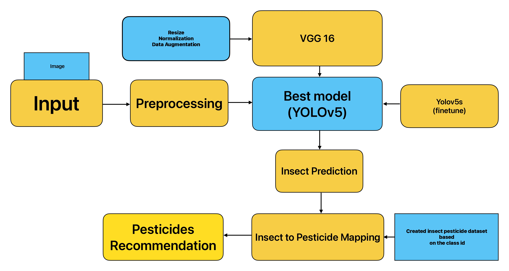

# Automated Insect Classification and Pest Control Recommendation System

[Slide Deck (PDF)](images/Automated_Insect_Classification_and_Pest_Control_Recommendation_System_ppt.pdf)

## Overview

This project aims to automate insect pest identification and recommend appropriate pesticides using advanced deep learning techniques. By leveraging state-of-the-art neural networks, the system efficiently classifies insect species from agricultural images and provides accurate pesticide recommendations.

## Dataset

The project utilizes the IP102 dataset containing:

* Over 75,000 labeled images
* 102 insect species commonly found in agricultural settings
* Bounding box annotations for object detection

Dataset available [here](https://www.kaggle.com/datasets/rtlmhjbn/ip02-dataset).

## Models Used

Two models were implemented and evaluated:

### VGG-16

* Higher classification accuracy (60.48% Top-1 Accuracy)
* Lower inference speed (\~25 images/sec)

### YOLOv5s (Selected Model)

* Faster inference speed (\~80 images/sec)
* Better object detection performance (mAP\@0.5: 55.48%)

YOLOv5s was selected for its superior speed and object detection capabilities, making it suitable for real-time applications.

##  Flowchart of Methodology

## Methodology

* **Data Preprocessing**: Image resizing, normalization, and dataset splitting (80% training, 20% validation).
* **Model Training**: YOLOv5s trained for 100 epochs with COCO-pretrained weights.
* **Performance Evaluation**: Metrics include accuracy, precision, recall, F1-score, inference speed, and mean Average Precision (mAP).
* **Pesticide Mapping**: Utilizes USDA National Insect & Disease Risk Mapping and EPA Pesticide Use Limitation Database for pesticide recommendations.

## Results

| Metric          | VGG-16     | YOLOv5s    |
| --------------- | ---------- | ---------- |
| Accuracy        | 60.48%     | 44.95%     |
| Precision       | 50.33%     | 52.19%     |
| Recall          | 46.68%     | 56.09%     |
| F1-Score        | 46.57%     | 54.00%     |
| Inference Speed | 25 img/sec | 80 img/sec |
| mAP\@0.5        | 52.53%     | 55.48%     |
